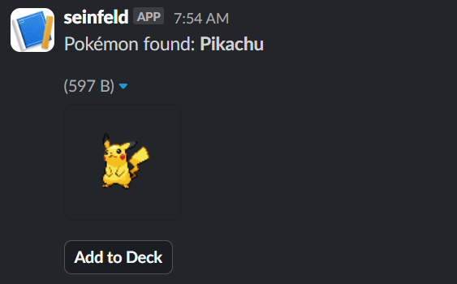
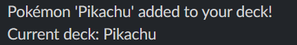
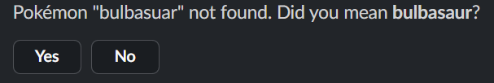
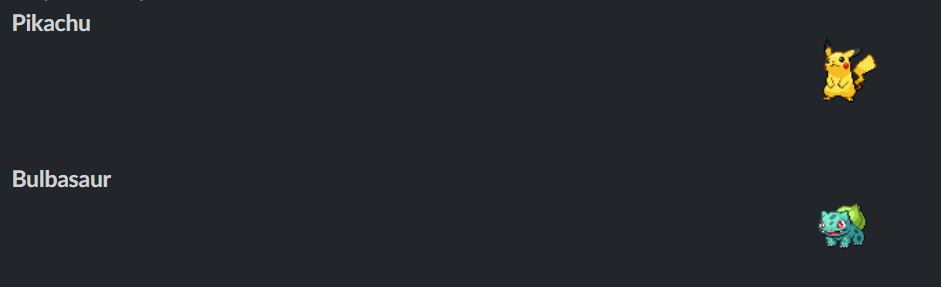

# Pokemon Slack app

A Slack app built with @slack/bolt and Express that lets users search for pokemon, add them to a local deck, and view their deck, all from Slack. The bot uses PokeAPI for Pokemon data and supports fuzzy search suggestions for misspelled names.

---

## Features
- `/jerry search <pokemon>`: Search for a Pokémon by name, see its image, and add it to your deck.
- `/jerry deck`: View your current deck (max 6 Pokémon, with icons).
- Fuzzy search: If you misspell a Pokémon, the bot suggests the closest match with a button to confirm.
- API endpoints protected by API key.

---

## Setup Instructions

### 1. Clone and Install
Install dependencies:
  ```sh
  npm install @slack/bolt express axios dotenv didyoumean2

### 2. Set up your `.env` file
Create a `.env` file in the root directory with:
```sh
SLACK_BOT_TOKEN=your-slack-bot-token
SLACK_SIGNING_SECRET=your-slack-signing-secret
MY_API_KEY=your-api-key
```

### 3. Expose your local server to Slack with ngrok

Start ngrok on your port (default 3000):
```sh
ngrok http 3000
```
Copy the HTTPS forwarding URL from ngrok (e.g., `https://abcd1234.ngrok.io`).

### 4. Configure your Slack App
- Set the **Slash Command** `/jerry` to point to `https://<ngrok-url>/slack/events`.
- Set the **Interactivity & Shortcuts** Request URL to `https://<ngrok-url>/slack/events`.
- Add the necessary bot scopes: `commands`, `chat:write`, etc.
- Install the app to your workspace.

### 5. Start the server
```sh
node bolt-app.js
```

---

## Sample Usage

- `/jerry search pikachu`  
  → Shows Pikachu's image and a button to add to your deck.
 


- Suggested name if misspelled 
  → Suggests "Did you mean pikachu?" with a button to confirm.
  
- `/jerry deck`  
  → Lists your current deck with Pokémon icons (max 6).
  
---

## Reflection
Building this Slack app was a great exercise. I first created the GET search, POST add, and GET deck in express and had those endpoints fully working but, I had to go back to have it go through bolt so I could add styling. I then use bolt and expressReceiver but realized that was not quite what the given instructions seemed to want. So, I finally seperated express and set it to to backend and created the bolt app that would use axios to feed request to express. 

For my own bonus I found a personal flaw on not being fluent enough in Pokemon names so I created a suggestion if a name was missed spelled instead of only feeding back the error of 'pokemon name not recognized'. I did this by retrieving every Pokemon name when the server first starts and then using library didyoumean2 to give the user back a pokemon name suggestion.

---

## Credits
- [PokéAPI](https://pokeapi.co/)
- [@slack/bolt](https://slack.dev/bolt/)
- [didyoumean2](https://www.npmjs.com/package/didyoumean2)
- [ngrok](https://ngrok.com/)
